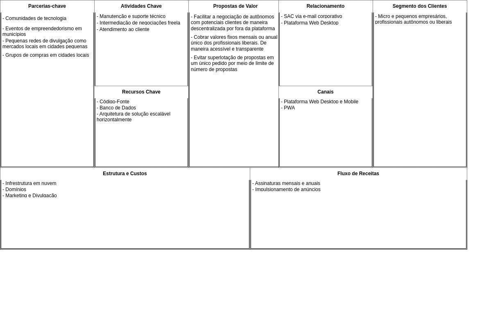
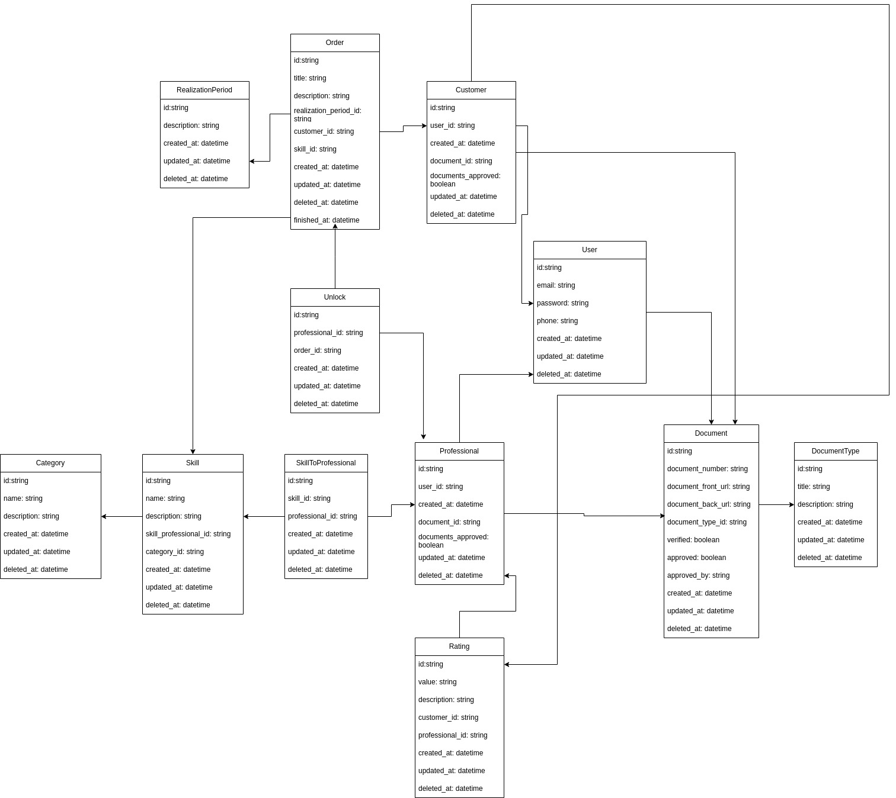

# Get Experts - Documentação Geral

## Descrição

## Canvas

## ER

## Requisitos
### Requisitos funcionais
- Autenticação e autorização de usuários, sendo estes clientes e/ou profissionais;
    - Clientes devem conseguir registrar-se como profissionais, e profissionais de igual modo como clientes;
    - Deve haver um fluxo para recuperação de senha;
    - Os usuários devem conseguir autenticar-se usando inclusive, login federado do Facebook ou Google;
    - É necessário que haja encerramento de sessão ou expiração da mesma após 7 dias autenticado.
- Verificação de documentos enviados pelos clientes e profissionais
    - Os clientes não precisam verificar obrigatóriamente seus documentos antes de publicar um pedido;
        - No entanto, deve ser exibido ao profissional que o cliente em questão ainda não verificou sua identidade;
    - Os profissionais precisam verificar obrigatoriamente seus documentos antes de interagir com um pedido de cliente;
    - Os documentos analisados devem ser aprovados por um administrador;
- Publicação de pedidos de serviço por parte dos clientes
    - O pedido deve possuir o período desejado de realização, o título, descrição, autor, habilidades necessárias e categoria correlacionada
- Atualização de pedido
    - Deve ser possível atualizar o título, descrição e habilidades necessárias do pedido
- Exclusão de pedido
    - Deve ser possível excluir o pedido
- Exibição de pedidos de serviço no feed dos profissionais
    - Os pedidos que ainda não foram exibidos e contatados 6 vezes, devem ser exibidos no feed dos profissionais
    - Os pedidos devem ser exibidos por localidade prioritariamente
- Desbloqueio de pedidos para contato
    - Os pedidios desbloqueados para visualização de contato, devem contabilizar até no máximoi 6 visualizações no pedido. E contabilizar na contagem segundo o plano do usuário
- Finalização de serviço
    - O cliente deve conseguir finalizar o pedido
- Avaliação de serviço
    - O cliente deve conseguir acessar o perfil do profissional e avaliar seu serviço
- Atualização de informações de usuário
    - Tanto profissionais quanto clientes, devem conseguir atualizar suas informações pessoais, com excessão de seu nome
- Atualização de documentos de usuário
    - Os documentos atualizados devem passar por nova avaliação e aprovação
### Requisitos não funcionais
- O registro de usuários deve permitir que os usuários criem contas, com logins's oAuth do Google e Facebook;
- Aos usuários que utilizarem autenticação não federada, deve haver uma etapa de verificação do e-mail, onde um código de confirmação será enviado ao e-mail do usuário;
- A verificação deve fornecer uma variedade de documentos disponíveis: RG/CPF, CTPS, Passaporte, RNE;
- O motivo da rejeição do documento deve ser exibido ao usuário;
- A maioria dos endpoints devem utilizar cache para garantir uma boa performance
- A exibição de pedidos deve ser filtrada por localidade, categoria, e intervalo de data de publicação